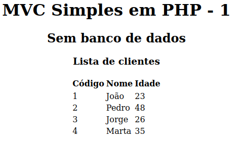

# Criação de um aplicativo em PHP com MVC do "zero"

## O exemplo mais simples que já vi.

Do mínimo até algo usável para mostrar bons recursos que são utilizadoso nos grandes frameworks

Em diversas fases, seguindo da inicial e seguindo em frente.

## Em várias fases

- Faça o download para seu diretório web
- Crie um banco de dados e importe o script db.sql
- Ajuste o Core/config.php para o banco criado. Veja as várias fases abaixo:

Fase inicial sem banco, apenas com um array

## Licença

MIT

